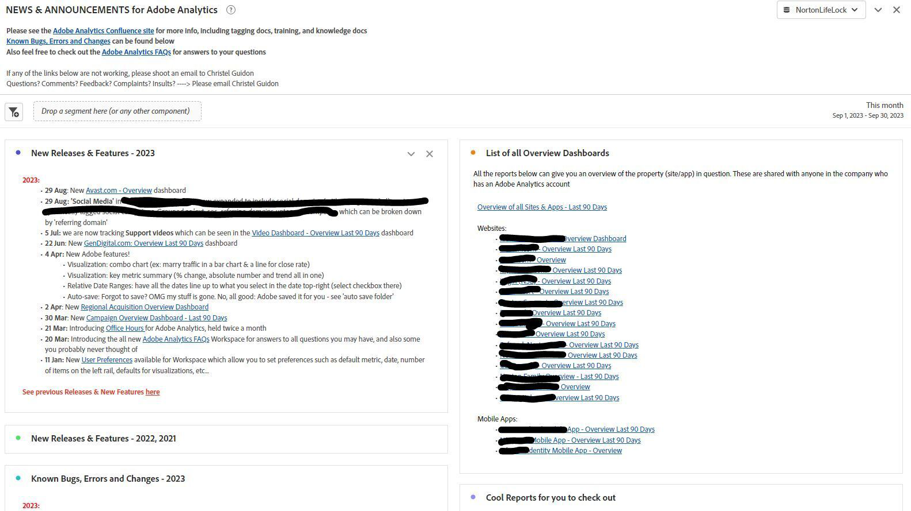

# Operationele dashboards maken in Analysis Workspace

_Ontdek hoe operationele dashboards in Adobe Analytics Workspace de communicatie en efficiëntie revolutioneren. Ontdek hoe u de dashboards van veelgestelde vragen, nieuws en aankondigingen en bugs en functies kunt maken voor gestroomlijnde informatie, verbeterde gebruikerservaring en verbeterde betrokkenheid._

Net als veel beheerders, voer ik een interne informatiehub (Confluence of zo) voor Adobe Analytics uit. In de loop der tijd werd ik het beu om dezelfde vragen te beantwoorden bij herhaling en had ik een soepele manier nodig om mijn gebruikers te bereiken zonder het gevoel te hebben dat ik hen voortdurend pingelde en irriteerde. Ik had gegevensbanken nodig voor informatie die minder statisch was.

Ik merkte dat de gebruikers vaak mijn verwijzingen naar de plaats van de Samenhang negeerden, met redenen zoals &quot;Mijn VPN is weg,&quot;of &quot;ik kan het nu niet lezen,&quot;etc. In feite betekent &quot;Ik lees die doc later&quot; dat het nooit zal worden gelezen, en dezelfde vraag zal volgende week opnieuw worden gesteld.

***De realisatie bereikte:**&#x200B;De veelzijdigheid van de werkruimte zou een spelwisselaar kunnen zijn. Gebruikers geven de voorkeur aan snelle, directe antwoorden in Workspace, dus laten we ze daar houden om extra stappen te voorkomen.*

Ik ging verder en creeerde operationele dashboards om bedrijf breed te delen. Tot nu toe hebben ze gebruikers op de hoogte gehouden, gecentraliseerde informatie gegeven en gefrustreerd. Dit is een eenvoudig, evoluerend proces geweest dat de efficiëntie in de loop der tijd verhoogt.

Mensen hebben een hoop goede informatie zonder mij kunnen krijgen, delen van de site kunnen begrijpen, kunnen zien hoe cool Adobe Analytics is, en (belangrijk voor mij?) minder vragen kunnen stellen en minder tijd in beslag nemen.

**Ik adviseer ten zeerste dat u dashboards voor al uw eigenschappen of belangrijkste gebieden van uw plaats creeert.** Ze moeten een overzicht geven van de eigenschap/site/app/flow en basisinformatie en snel inzicht hebben. Zij zouden met het gehele bedrijf moeten worden gedeeld, toestaand alle gebruikers om een inzicht in het bezit zonder enige handholding te krijgen. Deze dashboards beantwoorden meestal 80% van de vragen die ik krijg en besparen me kostbare tijd.

Niets van dit verhindert u om uw plaats van het Samenhang te houden, wat zeer nuttig blijft te hebben. Ik noem het zelfs boven aan elk operationeel dashboard. Maar ik hou van sneltoetsen - zowel voor mij als voor mijn gebruikers.

Laat me jullie door de drie operationele dashboards laten lopen die ik voor mijn bedrijf, GenDigital, heb gemaakt en die me hielpen deze doelen te bereiken.

1. Veelgestelde vragen
1. Nieuws en aankondigingen
1. Buggen, functies en hoofdreleaselogbestand

## 1 - Veelgestelde-dashboard

Geloofd van de eindeloze herhaling van antwoorden? Stop! Bespaar tijd door een FAQ-dashboard te maken. Gebruikers kunnen deze vragen of er snel een koppeling naar maken in hun reacties.

Alleen maken [tekstvisualisatie](https://experienceleague.adobe.com/docs/analytics/analyze/analysis-workspace/visualizations/text.html?lang=nl-NL) met vragen die zijn opgemaakt als titels en antwoorden/uitleg als inhoud, zijn alle samengevouwen om alleen de vraag weer te geven. Groepeer ze op relevantie (bijvoorbeeld pagina&#39;s of producten) of gebruik deelvensters. Houd het eenvoudig, die gemeenschappelijke vragen bij de bovenkant voorrang geven.

Werk uw Veelgestelde dashboard bij in plaats van lange e-mails te schrijven of oude uitleg opnieuw te ontdekken. Start nu en vouw de tijd uit. Gebruik hyperlinks om te verwijzen naar andere dashboards of verwante veelgestelde vragen in rapporten. Complexe context bieden wanneer dat nodig is door een koppeling te maken van andere dashboards naar veelgestelde vragen.

Voor Gen Digital richten onze veelgestelde vragen zich op aangepast Adobe Analytics-gebruik, niet op de basisbeginselen. E-mail specifieke verbindingen FAQ door met de rechtermuisknop aan te klikken, &quot;krijg visualisatiekoppeling,&quot;en het delen van ijdelheid URL. Hiermee wordt de exacte inhoud voor gebruikers gemarkeerd. Gebruik vrije-vormlijsten voor gegevensillustratie, toevoegend meer verklaringen met &quot;geef beschrijving uit.&quot;

Als uw veelgestelde vragen compleet zijn, kunt u ze delen met het bedrijf voor collectieve toegang en educatie. Verbeter indien nodig verder.

Hier zijn enkele schermafbeeldingen van hoe een FAQ-dashboard eruit kan zien:

## 2 - Het dashboard Nieuws en Mededelingen

Een ander nuttig operationeel dashboard is het dashboard voor nieuws en aankondigingen. Ik begon deze omdat ik informatie wilde krijgen voor mijn gebruikers, maar ik voelde dat ik ze in plaats daarvan prikte en irriteerde. Heeft iedereen deze update nodig? Welke gebruikers? Alleen energiegebruikers? Moet ik een wekelijkse nieuwsbrief sturen die niemand zal lezen? Door de update rechtstreeks in Workspace te hebben, kunnen de gebruikers het zien zodra zij login, en ik te hoeven niet om nog een bedrijfsE-mail te verzenden die niemand wil lezen.

Aangezien deze dashboards in het hele bedrijf worden gezien, stijgen de updates onmiddellijk tot de top. Hier volgt het type informatie dat ik opneem in het dashboard voor nieuws en aankondigingen:

- Feature-releases en updates aan onze zijde (voornamelijk codereleases)
- Belangrijke nieuwe functies van de Adobe
- Tijdschema kantooruren
- Lijst met alle overzichtsdashboards en -rapporten die moeten worden uitgecheckt

Het behandelt onze nieuwe functies, het volgen, en vitale dashboards. Met hyperlinks in tekstrapporten (of bij andere rapporten via een klik- en bewerkingsbeschrijving) kunt u een koppeling maken naar andere dashboards in Adobe Analytics of de releasepagina van de Adobe.

Zo ziet mijn dashboard Nieuws en Aankondiging eruit:

## 3 - Bugs, eigenschappen en belangrijk versielogboek

Het doel van dit operationele dashboard is om een centrale plaats te hebben om alle insecten en fouten te zetten. Ik heb dit altijd in Excel beheerd, maar het was lastig en moeilijk om te delen. Waarom niet rechtstreeks in Workspace?

U kunt het in het dashboard Nieuws &amp; Mededelingen integreren als u het minder prominent wilt. Nochtans, als insectenrapportering substantieel of kritiek aan uw bedrijf is, zou een afzonderlijk dashboard wijs kunnen zijn.

Ik gebruik een tekstvisualisatie en houd het heel eenvoudig met opsommingstekens. Het opsommingsteken staat vóór de datum van de bug en de eigenschap (bijvoorbeeld &#39;3jan23-17jan23 - Norton.com&#39;, &#39;Before to 14sep22 - Chat&#39;). Ik voeg de details toe en probeer ze kort en beknopt te houden. Ik vermijd erop te wijzen welk team fout was en vermijd toevoegend teveel technische details uw gebruikers waarschijnlijk niet om geven.

De meest recente bug staat bovenaan, terwijl oudere in jaarlijkse tekstrapporten staan (bijv. &quot;2022 - Bekende fouten, fouten en veranderingen&quot;) - allemaal samengevouwen.

Niets moois. Heel gemakkelijk te doen, en u moet toegeven, heel veel beter dan dat dossier van Excel u op uw harde aandrijving houdt en voortdurend op het Confluence bijwerkt.

Ik verwijs hier ook naar het Overzicht dashboards &amp; de Rapporten van de Koel, gelijkend op andere operationele dashboards. Koppelingen naar veelgestelde vragen en nieuws- en aankondigingsdashboards zijn naar boven gericht.

Hier is een voorbeeld van hoe uw logboek kan kijken:

Het maken van operationele dashboards in Adobe Analytics Workspace is voor mij een spelbreker geweest. Net als veel beheerders heb ik een interne hub beheerd en geworsteld met dubbele antwoorden en effectieve gebruikerscommunicatie. De behoefte aan dynamische opslagplaatsen leidde tot het besef dat de veelzijdigheid van Workspace de betrokkenheid zou kunnen veranderen. Ik hoop dat u de kracht van operationele dashboards in de Werkruimte van Adobe Analytics omarmt. Verbeter de gebruikerservaring, bespaar tijd en geniet van een beter georganiseerde omgeving. Je reis begint nu, en deze dashboards zijn je sleutels tot efficiëntie en gebruiksvriendelijkheid.

## Auteur

Dit document is geschreven door:

**Christel Guidon**, Digital Analytics Platform Manager bij Gen

Adobe Analytics Champion