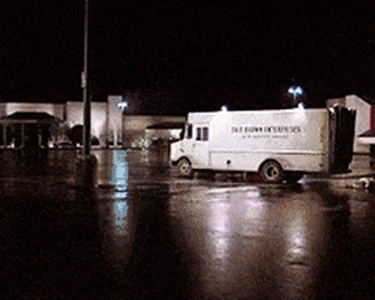

# Deelvenster Kenmerken van Adobe Analytics en Windows opzoeken

Leer hoe u het deelvenster Kenmerken en het venster Opzoeken gebruikt om het gedrag van de klant te begrijpen en aan te passen hoe de dimensie-items krediet krijgen voor succesgebeurtenissen.

## Het deelvenster Kenmerken gebruiken

&quot;Geweldige Scott!&quot;

Zodra ik dacht aan de [Deelvenster Kenmerken](https://experienceleague.adobe.com/docs/analytics-platform/using/cja-workspace/panels/attribution.html) en **Venster Opzoeken**, ik werd herinnerd aan het liedje &quot;Back in Time&quot; van Huey Lewis en The News; Toen werd ik er natuurlijk ook aan herinnerd dat onze typische reactie op vele nieuwe instrumenten als deze is om het te proberen uit te stellen, omdat ze er zo ingewikkeld uitzien.

Ik bedoel eigenlijk, bekijk enkel al die opties, schakelaars, panelen, lezingen, en knopen.  En serieus, laten we het hebben over die fluxcondensator.  Wacht, zei ik gewoon fluxcondensator?

OK, ik geef toe **Deelvenster Kenmerken** is een vrij complex instrument; onze typische taak als analisten is echter , dag in dag uit , een zeer complex instrument te gebruiken om te kijken naar wat er in het verleden is gebeurd .  Dat gereedschap heet **Adobe Analytics**!

Waarom zouden we dan iets als een beetje angst in de weg moeten staan aan zo&#39;n cool en krachtig instrument dat ons in staat stelt om elke dag letterlijk achterwaarts te kijken?

Dat is allemaal zo, toch?  HEEN?!! (Ik bedoel, kom op, ik ben er vrij zeker van dat het nog steeds OK en &quot;politiek correct&quot; is om ons geeks te noemen?)

Ah, wat maakt het uit?  Teken omhoog, Geeks, Nerds, Goobers, Dweebs, en Techies (ja zelfs de Trekkies), kan ik nu de auto stereo horen:

&quot;Dus neem me weg, ik vind het niet erg!  Maar je kunt me beter beloven... IK BEN TERUG IN TIJD!&quot;

Ik heb je aandacht, toch?  Geweldig!

Laten we de zaken een beetje afbreken.  Nu zijn we allemaal enthousiast over **tijdreis**, laten we een stap terug doen en vaststellen wat de **Deelvenster Kenmerken** echt is :

Nee, nee, nee, nee!  Laten we nog niet afleiden.  Misschien, laten we dat opnieuw proberen:

In **Attributie** Overweeg eenvoudig hoe gebeurtenissen/acties kunnen worden veroorzaakt door een individu, meerdere personen of een of meer verschillende dingen in de loop van de tijd.

Volgens [Adobe](https://experienceleague.adobe.com/docs/analytics-platform/using/cja-dataviews/component-settings/attribution.html)Dankzij attributie kunnen analisten aanpassen hoe dimensie-items krediet krijgen voor succesgebeurtenissen.  In feite, is geen bepaalde klantenreis echt lineair en minder vaak voorspelbaar.  Moreso, elke klant zal in zijn eigen tempo te werk gaan; vaak kunnen ze teruggaan, stoppen, uitvallen of andere niet-lineaire gedragingen volgen. Deze biologische acties maken het moeilijk of praktisch onmogelijk om de impact van marketinginspanningen op de hele reis van de klant te kennen. Ook wordt het hierdoor lastig om meerdere datakanalen aan elkaar te koppelen.

Kent iemand van deze dingen je?  Denk er eens aan in de context van de reis van Marty McFly:

Vanaf het moment dat hij de parkeerplaats Twin Pines Mall vluchtte tot toen hij zich letterlijk uit de DeLorean gooide voordat hij door een locomotief van 210 ton werd weggejaagd, lijkt het verre van lineair, en het is niets wat iemand had kunnen voorspellen.

Maar door de kracht van filmmagie, kunnen we Marty&#39;s pad door de tijd heen volgen en al zijn aanraakpunten begrijpen, zijn krabbels, dubbele achtergronden en uitvallen.

## Attributiemodellen

In het echte leven kunnen we de **Deelvenster Kenmerken** om verschillende dingen te zien.  Bijvoorbeeld de **Attributiemodellen** laten zien hoe onze **conversies** worden verspreid over **treffers** in een bepaalde groep.

Eenvoudig gezegd, als 10 mensen op een knop drukken om door een deur te stappen, zullen onze Attribution Models ons vertellen welke van die 10 mensen we de eer willen geven om op die knop te drukken.  In dit verband zijn er enkele voorbeelden van hoe de attributiemodellen die 10 mensen zouden kunnen beïnvloeden:
* **Eerste aanraking**: Deze is precies zoals het klinkt.  In dit geval geeft het 100% krediet aan de eerste persoon die door de deur liep.  Hiervoor zullen marketeers dit vaker gebruiken voor tactieken als Social of Display, maar het is vaak een geweldige tactiek voor de doeltreffendheid van on-site productaanbevelingen.
* **Laatste aanraking**: Het klinkt precies zo.   Dit model geeft 100% krediet aan de laatste persoon die de deur in liep.  Dit model wordt vaak gebruikt om dingen als Onderzoek en kortetermijnmarketing cycluscampagnes te analyseren.
* **Lineair**: Dit geeft evenveel eer aan elke persoon die door de deur liep.  Dat klopt - Je krijgt een DeLorean, en je krijgt een DeLorean, en je krijgt een DeLorean.  IEDEREEN HEEFT EEN DELOREAN!!
* **U-vorm**: Deze geeft 40 procent van het krediet aan de eerste in de deur, spreidt 20 procent van het krediet naar iedereen ertussen en geeft dan 40 procent aan de laatste erdoor.  Denk aan een situatie waarin je de meerderheidsomzettingen zowel aan de voor- als aan de achterkant wilt herkennen, maar ook een klein deel van de kredieten wil doorhalen voor een aantal van de interacties die daartussen bijdragen.
* **Tijdverlies**: Ik zou deze niet met u delen voordat ik u naar de officiële documentatie stuurt om de resterende modellen te bekijken.  Net als Doc Brown&#39;s plutonium heeft dit model letterlijk een halfwaardetijd die exponentieel vervalt!  In dit geval is de standaardparameter voor de halfwaardetijd van dit model 7 dagen.  De manier het werkt is dan gewicht op elk Kanaal van de Marketing toe te passen, die op de hoeveelheid tijd wordt gebaseerd die na het aanvankelijke aanraakpunt overgaat en wanneer de klant omzet.

Voor meer informatie hierover en de overige **Attributiemodellen**, [klik hier](https://experienceleague.adobe.com/docs/analytics/analyze/analysis-workspace/attribution/models.html).

Om dit nog interessanter te maken, praten we over de **Windows opzoeken**.

Yup, hier gaan we - neem ons terug in de tijd!!  Want hier begint de pret!

Adobe definieert **Windows opzoeken** als &quot; de hoeveelheid tijd die een conversie moet terugkijken om aanraakpunten op te nemen . Attributiemodellen die meer krediet geven aan eerste interacties zien grotere verschillen bij het weergeven van verschillende terugkijkvensters.&quot;

* **Het terugkijkvenster van de bezoek**: Kijkt terug naar het begin van een bezoek toen een omzetting plaatsvond
* **Het terugkijkvenster van de bezoeker**: Kijkt naar alle bezoeken terug tot de eerste van de maand van de huidige datumwaaier.
* **Aangepast terugzoekvenster**: Staat u toe om het Venster van de Attributie buiten de rapporteringsdatumwaaier tot maximaal uit te breiden **90 dagen**.

Als je ALLE Terug naar de Toekomstige films hebt gezien, dan weet je dat Marty McFly meer dan één keer terug is in de tijd, en je weet ook dat hij meer dan één keer terug is gegaan naar 1955.  Als we de overname van &quot;Gray&#39;s Sports Almanac&quot; als onze conversiegebeurtenis beschouwen, moet u het volgende overwegen:

1. Iets eerder **13:30** op **26 oktober 1985**, Marty McFly gaat terug in de tijd naar **5 november 1955**, waar hij voor het eerst over een dennenboom loopt in een tijdreis van DeLorean.  In de komende anderhalf jaar communiceert hij met meerdere mensen, waaronder zijn ouders, die uiteindelijk de toekomst beïnvloeden door zijn vader te beïnvloeden om op te komen voor een pestkop genaamd Biff, zodat zijn vader zijn eigen potentieel kan realiseren om een succesvolle wetenschapsauteur te worden.
1. Later dezelfde ochtend op **26 oktober 1985** Dr. Emmett Brown komt aan op de autoweg van Marty McFly om hem en zijn vriendin te informeren dat er iets verschrikkelijk mis is gegaan met hun kinderen en ze moeten naar de toekomst gaan om hun problemen op te lossen.  Terwijl ze vertrekken, is hun vertrek getuige van Biff, die het vreemd vindt om een vlucht DeLorean te zien.  Later, in de toekomst, als Biff weer getuige is van een vliegende DeLorean en zelfs later nog zicht krijgt op &quot;twee versies&quot; van Marty, begint hij de zaken samen te stellen.   Toen hij Doc Brown en Marty hoorde beweren dat de &quot;tijdmachine&quot; nooit gebruikt zou moeten worden voor persoonlijk gewin en alleen voor onderzoek (omdat Marty had gepoogd een sportalmanac terug te nemen naar het verleden om wat persoonlijke weddenschappen te maken), steelt Biff de tijdmachine terwijl de twee de sport almanac in het verleden afleiden naar zijn jongere zelf.
1. Na hun reis naar de toekomst keren Doc Brown en Marty terug naar een **26 oktober 1985** Ze herkennen het niet en ze trekken uit dat de tijdslijn veranderd is door een kwaadaardig bijval.  Ze moeten zich realiseren wat er is gebeurd, Doc en Marty willen terugkeren naar **12 november 1955**, de fatale nacht toen alles veranderd werd door Marty toen hij voor het eerst bezocht **1955**.  Doc en Marty besparen uiteindelijk de dag door de almanac van de sport die Old Biff van de toekomst had geleverd aan Young Biff terug te sturen **1955**, maar niet zonder een andere twist moet je echt de volledige trilogie van films bekijken om echt te genieten en te begrijpen.

Afhankelijk van onze **Attributiemodel** en **Venster Opzoeken** We kunnen uiteindelijk met een paar interessante scenario&#39;s komen:

* Gebruiken **eerste aanraking** en **terugzoekvenster bezoeken** De toeschouwer kijkt naar het bezoek van Marty waar de meest recente &quot;conversie&quot; plaatsvond, namelijk toen hij en Doc erin slaagden de sporthalmanac terug te stelen van Young Biff en zijn aversie op mest te behouden.

* Geloof het of niet, gebruik **eerste aanraking** en **terugkijkvenster bezoeker** Toewijzing zou de conversie begunstigen wanneer Biff uiteindelijk wint.
* Een **lineair terugkijkvenster** resulteert in een multiversum waarin elke tijdlijn bestaat.  Sorry, dit is niet **Marvel** of **Star Trek**!

Op dit moment hoop ik dat je het idee begint te krijgen.

Wat betekent dit voor ons als analisten?

De **Deelvenster Kenmerken** en **Venster Opzoeken** geven ons de macht om voorbij de eenvoudige, oppervlakte-vlakke gegevens te kijken en dieper in de klantenreis te duiken. Door te begrijpen welke aanraakpunten de grootste invloed op conversies hebben gehad, kunnen we geïnformeerde beslissingen nemen over onze marketingstrategieën en effectiever middelen toewijzen.

Herinner me, nadat u hebt **Attributiemodellen** en **Windows opzoeken** geselecteerd, hebt u nog de capaciteit om uw gegevens verder te manipuleren door het met een segment of een andere component te filtreren u wenst.  Bovendien beschikt u na het weergeven van het deelvenster over alle functies van een traditioneel **Werkruimte**, wat betekent dat je officieel toestemming hebt om 88 mph te besturen!

## Tot slot de richtlijn in de praktijk brengen

Nu je de concepten hebt, stel je voor dat je een marketingcampagne voert en probeert te bepalen welk kanaal het meest effectief is voor het besturen van conversies. Met de hulp van de **Deelvenster Kenmerken** niet alleen de **Laatste aanraking**, maar ook de **Eerste aanraking**, **Zelfde aanraking** en elk ander model dat u kiest, om te bepalen welke kanalen het meest geschikt zijn voor het besturen van uw conversies. Deze informatie kan vervolgens worden gebruikt om uw campagnes te optimaliseren en de algehele prestaties te verbeteren.

Nu je hebt gezien wat het kan doen, ben je niet geïntimideerd door de schijnbaar complexe kenmerken van de **Deelvenster Kenmerken**.  **Gezicht** het.  **Embrace** het.  **Begrijpen** het.  En vooral, gebruik het in uw voordeel. De **Deelvenster Kenmerken** en **Venster Opzoeken** zijn de sleutels om een dieper inzicht in uw klanten en hun reis met uw merk te ontsluiten.

Nu kunnen we met vertrouwen &quot;terug in de tijd&quot; reizen en de kracht van onze vertrouwde tijdmachine gebruiken (ook wel  **Adobe Analytics**) gegevensgestuurde beslissingen te nemen; en, het belangrijkste, onthoud: &quot;Waar gaan we, we hebben geen wegen nodig!&quot; (Alleen een fluxcondensator en een scherp oog voor attributie!)

## Auteur

Dit document is geschreven door:

**Jeff Bloomer**, manager, Digital Analytics bij Kroger Personal Finance

Adobe Analytics Champion
