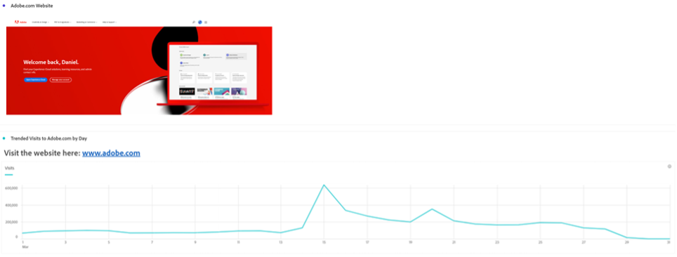

# Meer dan woorden - tekstvisualisaties en -beschrijvingen gebruiken in Analysis Workspace

Als Adobe Analytics Analysis Workspace-gebruiker is het natuurlijk dat je focus vaak naar je data- en datavisualisaties gaat - iedereen kan een samenvatting typen, niet? Als u echter de functies in Analysis Workspace, zoals de tekstvisualisatie of de visualisatiebeschrijvingen, over het hoofd ziet, kunt u een waardevolle kans missen om uw inzichten te combineren met waardevolle tekst, afbeeldingen, geschenken en koppelingen. Door verwijzingen en meer context te geven om uw gebruikers te informeren over wat uw gegevens betekenen, kan het effectiever en effectiever maken.

Eerst, zorg ervoor u weet waar u deze eigenschappen kunt vinden:

- Als u de beschrijving van een visualisatie wilt toevoegen of wijzigen, klikt u met de rechtermuisknop op het bovenste gebied van het element en selecteert u de koppeling Beschrijving bewerken:

   

- Als u een apart deelvenster Tekst wilt toevoegen, klikt u op het menu Visualisaties van de linkernavigatiebalk:

   

Hoewel deze handleiding een voorbeeld weergeeft met een van deze twee methoden, kunt u vergelijkbare toevoegingen aanbrengen in zowel beschrijvingen als tekstvisualisaties. U kunt ook de lettertypestijl, -uitlijning, -kleur aanpassen en lijsten met opsommingstekens of genummerde lijsten samenstellen:

Laten we beginnen. Een heel handig stukje context dat u aan een Analysis Workspace-project kunt toevoegen, is een hyperlink. Dit kan een koppeling bevatten naar de URL van de pagina die in het rapport wordt beschreven, koppelingen naar andere Analysis Workspace-projecten, externe pagina&#39;s met rapportcontext of iets anders dat handig kan zijn voor het bekijken van uw rapport. Deze functie is toegankelijk door een willekeurig gedeelte van de tekst te selecteren en het pictogram &quot;Koppeling&quot; te selecteren:

Het resultaat is dat iedereen die het Analysis Workspace-project bekijkt, met één klik elke pagina kan bereiken die voor hen online of in het intranet van uw organisatie toegankelijk is:

Als u de inhoud nu liever rechtstreeks in uw rapport wilt opnemen, kunt u een koppeling Afbeelding gebruiken om de inhoud naast uw gegevens te plaatsen:

U kunt een afbeelding die toegankelijk is via elke openbare URL toevoegen aan uw rapport, zolang de URL zich in *https* en is opgemaakt als .png, .jpeg, .jpg of .gif. Hoewel dit beperkt kan klinken, kunnen alle onlinegereedschappen die worden gebruikt om afbeeldingen of GIFFEN te delen, zoals .imgur of .GIPHY, een snelle methode bieden om bestanden die toegankelijk zijn voor de werkruimte te uploaden met behulp van een Share Link.

Het resultaat? U kunt de webpagina weergeven waarnaar uw gegevens rechtstreeks in uw project verwijzen:

U kunt GIFFEN in uw projecten ook gebruiken om bewegende beelden zoals een plaatsanalyse, ideale weg door uw plaats of een taak op uw app te omvatten, of eenvoudig uw team te tonen hoe ***verbijsterend*** uw rapporten zijn nu :

## Auteur

Dit document is geschreven door:

**Dan Cummings**, Sr. Product Engineering Analytics Manager bij McDonald&#39;s Corporation

Adobe Analytics Champion

