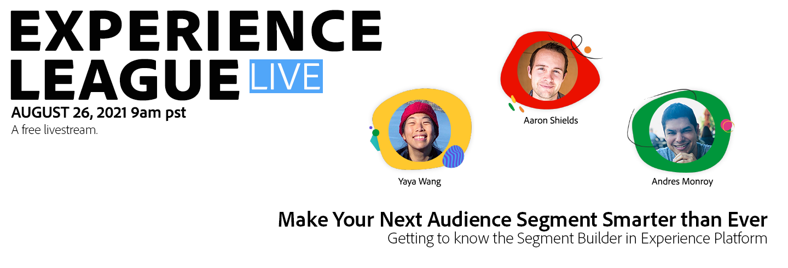
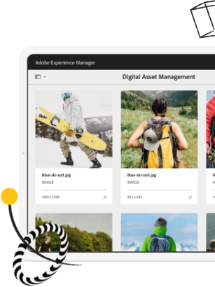

# Experience League LIVE

## Doe mee voor de volgende episode!

Experience League LIVE is een live streaming show die wordt gemaakt door het team van Experiencen League.  Het is een kans om met de productdeskundigen van Adobe te verbinden en actionable uiteinden, trucs, en strategieën te leren u met de toepassingen van Adobe Experience Cloud kunt toepassen.

## Actuele Experience League LIVE-gebeurtenissen!

<table>
<tr>
  <td>
      
     

          <strong>Klantreizen</strong>
     

     

          <em>September 2021</em>
     

    

    <em>Leer van productdeskundigen over het opbouwen van ervaringen die in real-time aan klanten worden aangepast</em>
    

  </td>
  <td>
      
     

          <strong>Content en commerce</strong>
     

          <em>Oktober 2021</em>
     

     

    

    <em>Leer om inhoud op schaal te creëren en te beheren en gepersonaliseerde handelservaringen te bouwen</em>
    

  </td>
  <td>
      
     

          <strong>Experience Platform</strong>
     

     

          <em>december 2021</em>
     
    
    

    <em>Leer van productdeskundigen over het opbouwen van ervaringen die in real-time aan klanten worden aangepast</em>
    

  </td>
</tr>
</table>

## Afgelopen episodes

Heb je een aflevering van Experience League LIVE gemist? We vergeven je. Bekijk al onze eerdere afleveringen!

<table>
<tr>

<td>
    
     

          <strong>Gasten</strong> : <i>Eric Matisoff en Dasha Fitzpatrick</i>
     

     

          <em>29 juli 2021</em>
     
    
    

    <em></em>
    

  </td>
</tr>
</table>

>[!TIP]
>
>Ontdek gratis onze gratis leermethoden [cursussen](https://experienceleague.adobe.com/#dashboard/learning) en individuele [zelfstudies](https://experienceleague.adobe.com/docs/home-tutorials.html).
