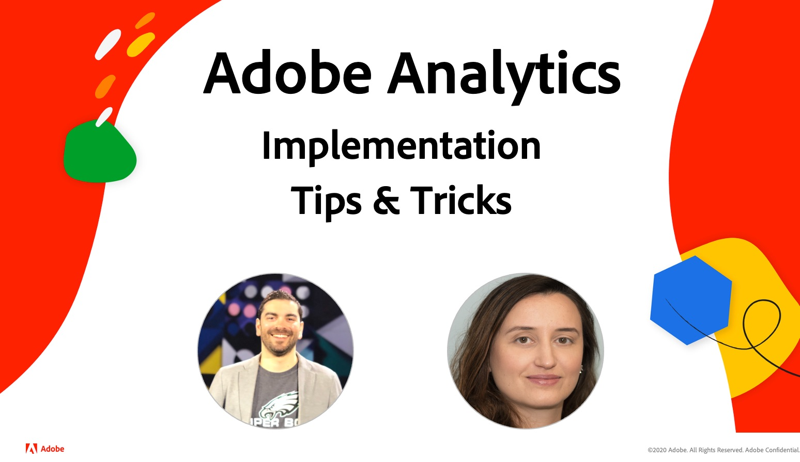

# EXPERIENCE LEAGUE LIVE

## Doe mee voor de volgende episode!

Experience League LIVE is een live streaming show die wordt gemaakt door het Experience League-team.  Het is een kans om verbinding te maken met Adobe-productexperts en actiepunten, trucs en strategieën te leren die u kunt toepassen met de Adobe Experience Cloud-toepassingen.

## Aanstaande Experience League LIVE-gebeurtenissen!

<table>
<tr>
  <td>
      
     

          <strong> de Reizen van de Klant </strong>
     

     

          <em>September 2021</em>
     

    

    <em> leer van productdeskundigen over het bouwen van ervaringen die aan klanten in echt aanpassen </em>
    

  </td>
  <td>
      
     

          <strong> Inhoud en Commerce </strong>
     

          <em>Oktober 2021</em>
     

     

    

    <em> Leer hoe te om inhoud tot stand te brengen en te beheren bij schaal en gepersonaliseerde handelservaringen te bouwen </em>
    

  </td>
  <td>
      
     

          <strong>Experience Platform</strong>
     

     

          <em> December 2021 </em>
     
    
    

    <em> leer van productdeskundigen over het bouwen van ervaringen die aan klanten in echt aanpassen </em>
    

  </td>
</tr>
</table>

## Afgelopen episodes

Heb je een aflevering van Experience League LIVE gemist? We vergeven je. Bekijk al onze eerdere afleveringen!

<table>
<tr>

<td>
    
     

          <strong> Gasten </strong> : <i> Eric Matisoff en Dasha Fitzpatrick </i>
     

     

          <em> 29 juli, 2021 </em>
     
    
    

    <em></em>
    

  </td>
</tr>
</table>

>[!TIP]
>
>Voor extra methodes om te leren, controleer onze vrije [&#x200B; cursussen &#x200B;](https://experienceleague.adobe.com/#dashboard/learning) evenals individuele [&#x200B; leerprogramma&#39;s &#x200B;](https://experienceleague.adobe.com/docs/home-tutorials.html).
