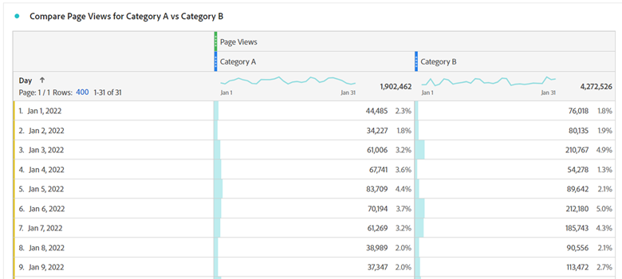

# Een uitgebreide handleiding voor de overgang van Google Analytics naar Adobe Analytics

## 1. Inleiding

Een van de grootste uitdagingen bij het schakelen tussen alle tools is het leren waar equivalente functionaliteit te vinden is en leren hoe u deze efficiënt kunt gebruiken. Deze discussie maakt deel uit van een grotere handleiding om gebruikers te helpen gemakkelijker over te stappen naar Adobe Analytics (als een nieuwe gebruiker of een gebruiker die afkomstig is van Google Analytics). een diepgaande vergelijking met GA; als het meest waarschijnlijke vergelijkend instrument waarmee de meeste gebruikers vertrouwd zullen raken; wordt verstrekt om gebruikers te helpen bestaande kennis aan de nieuwe toolset correleren. Hoewel de praktijk niet kan worden vervangen; dit zal u helpen beginnen en hopelijk vermindert de frustraties u tijdens deze tijd ( of zelfs als verfrisser na u begint in het zwaai van dingen te raken) kunt ontmoeten.

We moeten ook een snelle vergelijking van de terminologie hebben:

| **Beschrijving** | **Adobe Analytics** | **Google Analytics** |
|--------------------------------------------------------------------------------------------------------------------------------|---------------------|----------------------|
| Er is een gebeurtenismetrische waarde weergegeven die een pagina (of scherm in een app) vertegenwoordigt | Paginaweergave | Voorvertoning |
| Een metrische waarde die een groep interacties op uw website of app vertegenwoordigt die in hetzelfde tijdframe plaatsvinden | Bezoek | Sessie |
| Een metrische waarde die een geïdentificeerd apparaat definieert (op basis van meerdere criteria, waaronder cookies en andere gedragspatronen) om gebruikersinformatie te koppelen. | Unieke bezoeker | Gebruiker |

## 2. De interfaces

Een van de dingen die ik het vaakst zie wanneer mensen Adobe Analytics en Google Analytics vergelijken, is dat Adobe veel gaande is - het is ontmoedigend voor mensen. Dit is waar, maar het is ook waar; al dan niet geloven; een kracht, geen zwakte. Adobe biedt een breed scala aan hulpmiddelen en flexibiliteit in uw gegevensvisualisatie, zodat u veel meer vrijheid hebt om te bouwen wat u nodig hebt.

Laten we beginnen met de &#39;in-site&#39; rapportage.

### 2.1 Rapportage ter plaatse

#### 2.1.1. Startscherm

Zowel Adobe Analytics als Google Analytics bieden een manier om de eerste weergave aan te passen die een gebruiker ziet wanneer hij of zij zich aanmeldt.

##### 2.1.1.1. Werkruimte / Startscherm aangepaste set (Adobe Analytics)

Adobe Analytics gaat ervan uit dat het een vooraf samengesteld rapport maakt dat door alle gebruikers wordt weergegeven bij het aanmelden. De standaardhomepage neemt de gebruiker aan het de landende scherm van de Werkruimte die elke gebruiker alle werkruimterapporten zal tonen die zij creeerden of met hen werden gedeeld. Ook, heeft elke gebruiker de capaciteit om het even welk van deze rapporten als hun huisscherm te plaatsen als zij zo kiezen.

Hieronder vindt u meer informatie over de werkruimte in deze handleiding. Zie punt 2.1.2.1

>[!TIP]
>
>Creeer/deel sommige standaardrapporten voor uw organisatie zodat zij een uitgangspunt hebben om informatie te zien zonder het moeten in de bouw van hun eigen rapporten meteen duiken.

##### 2.1.1.2. Schermafbeeldingen thuis (Google Analytics)

* Google Analytics Home Screen heeft enkele vooraf gebouwde visualisaties voor u.  Deze omvatten zaken als:
* Gebruikers, sessies, Bounce Rate en Session Duration in de laatste 7 dagen
* Gebruikers op tijdstip van de dag in de laatste 30 dagen
* Huidige gebruikers nu en de bovenste actieve pagina&#39;s
* Verkeerskanaal, bron/medium en verwijzingen in de laatste 7 dagen
* Sessies per land in de laatste 7 dagen
* Bovenste pagina&#39;s voor de laatste 7 dagen
* Ontwikkeling van actieve gebruikers in de afgelopen 30 dagen
* en meer

In GA4 hebben gebruikers meer opties om hun eigen rapporten aan het Homescherm aan te passen en toe te voegen.

Dit is waarschijnlijk het enige dat u het meest zult missen wanneer u naar Adobe komt. ze hebben niet zo&#39;n beginscherm dat voor u vooraf is gemaakt, maar u kunt eenvoudig een aangepaste werkruimte instellen om te repliceren wat u van het bovenstaande nodig hebt en, als u dat wilt, instellen als het landingsscherm. Meer informatie hierover vindt u later (of zie sectie 2.1.2.1 Adobe Workspace).

#### 2.1.2. Report Builder ter plaatse

Naast de Eenvoudige Rapporten die de analysehulpmiddelen bonden, verstrekt elk hulpmiddel ook krachtigere hulpmiddelen waarmee om uw eigen douanerapporten te bouwen.

##### 2.1.2.1. Adobe Analytics Workspace

Dit is de motor van Adobe Analytics, sinds de introductie ervan in 2017, is het de weg naar analytische analyse geworden, en de belangrijkste reden waarom de sectie Rapporten binnenkort zal worden verst.

Met dit gereedschap kunt u rapporten opbouwen met bijna volledige vrijheid.

Het rapport kan worden opgedeeld in deelvensters en die deelvensters kunnen een willekeurig aantal visualisaties bevatten. Deelvensters kunnen worden ingesteld op algemene informatie, zoals datumbereik en algemene segmentfilters.

U kunt zowel de deelvensters als de visualisaties in de deelvensters groter of kleiner maken en rond de deelvensters slepen om items naast elkaar weer te geven, of u kunt ze stapelen. Als u dus twee verschillende gegevensreeksen naast elkaar wilt vergelijken, kunt u panelen maken die 50/50 in het midden splitsen en de twee sites naast elkaar weergeven, zodat u ze gemakkelijk kunt vergelijken.

Gebruikers beschikken over een groot aantal visualisaties:

* Vrije-vormentabel
* Cohorttabel
* Uitval
* Stroom
* Grafieken
   * Gebied (gestapeld en niet gestapeld)
   * Lijn
   * Spreiding
   * Staaf (gestapeld en niet gestapeld)
   * Opsommingsteken
   * Cirkeldiagram
   * Histogram
   * Horizontale balk (gestapeld en niet gestapeld)
* Kaart
* Samenvattingsblokken
   * Samenvattingswijziging
   * Samenvattingstekst
   * Tekst (tekstveld zonder invoervak waarin extra informatie moet worden ingevoerd om context te geven)
* Venn

Elk deelvenster en elke visualisatie kunnen een naam krijgen en er kan een beschrijving op worden toegepast om context te geven aan wat de informatie weergeeft.
In Adobe zijn segmenten (in feite gegevensfilters) retroactief van toepassing. Deze kunnen worden opgehaald in kolommen van vrije-vormtabellen om gegevens naast elkaar te vergelijken. Bijvoorbeeld, als een gebruiker twee verschillende categorieën op hun plaats voor verkeer wilde vergelijken; zij zouden een segment voor &quot;categorie A&quot; en een ander segment voor &quot;categorie B&quot; kunnen maken.

In vrije-vormtabellen zijn meerdere kolommen en segmentatie mogelijk, indien nodig, om de gegevens op de gewenste manier te visualiseren.

Wilt u uit het bovenstaande geen uitsplitsing naar datum zien? Sleep gewoon een andere dimensie of segment om de gegevens op een andere manier te bekijken... zoals bij het gebruik van segmenten voor Apparaattype en voeg vervolgens een uitsplitsing toe per besturingssysteem voor uw mobiele gebruikers/gebruikers van tablets:

Met de werkruimte kan uw creativiteit vliegen, u bent niet beperkt tot standaardstoringen. U kunt de visualisaties opbouwen die u nodig hebt om diepgaand in de vergelijkingen te duiken u moet in werking stellen.

>[!TIP]
>
>Wees niet bang om te spelen en te verkennen, er zijn zoveel manieren om buiten de doos te denken, om te zien wat je kunt doen! Maar zorg er ook voor dat je probeert te valideren dat wat je hebt gebouwd echt laat zien wat je denkt dat het is. Ervaring hier zal helpen!

U kunt zelfs berekende metriek of segmenten tot stand brengen die slechts binnen het rapport leven (verhinderend overstroming uw segment en berekeningen bewaarplaats, maar ook ervoor zorgen dat u gerichte punten kunt tot stand brengen die voor specifieke rapporten nodig zijn zonder uw organisatie met dingen te verwarren die niet zeer bruikbaar in andere contexten zijn.

Deze discussie is slechts een inleiding op dit instrument, er zullen andere uitgebreidere gidsen zijn om u te beginnen, maar wanneer u doet, zult u uitvoerige rapporten zoals kunnen maken:

Opgemerkt moet worden dat Workspaces niet automatisch-sparen, zodat is het gemakkelijker om een eenmalig ad-hocrapport te doen zonder uw rapportbewaarplaats te registreren.

Een andere krachtige eigenschap van werkruimten is de capaciteit om interactieve bepalingen op uw rapporten in de vorm van drop-down toe te passen. Hoewel deze drop-down niet aan uitgevoerde CSV of dossiers van PDF van uw rapporten zal werken, binnen het levende rapport staan zij u toe om alle visualisaties in een paneel bij te werken om het zelfde rapport onder verschillende voorwaarden te tonen. Meerdere vervolgkeuzelijsten kunnen worden gebruikt en zolang de opties elkaar niet uitsluiten, worden de geselecteerde items gestapeld zodat er op een schone manier informatie kan worden weergegeven.

>[!IMPORTANT]
>
>Meer lezen over het gebruiken van drop-down en vrije formuitsplitsingen zie <https://experienceleaguecommunities.adobe.com/t5/adobe-analytics-discussions/the-power-of-dropdown-filters-and-dimension-breakdowns-in-adobe/td-p/434680>

##### 2.1.2.2. Google Analytics: Dashboards, Aangepaste rapporten en Opgeslagen rapporten

Google beschikt over een paar gereedschappen voor het maken van rapporten binnen de interface, maar deze werken nog steeds met dezelfde weergave en beperkingen van de rapportsectie.

Nu, voor degenen die in Google Analytics zijn geverfd als je dit leest, zou je kunnen zeggen: &quot;Wacht even even, wat met Google Data Studio, is dat geen beter equivalent aan Adobe Workspace?&quot; en u zou correct zijn, maar omdat de Studio van Gegevens geen technisch deel van het hulpmiddel van Analytics is, en voor verbindingen aan verschillende gegevensbronnen toestaat, wordt dit hulpmiddel behandeld later in de &quot;Uitgebreide sectie van de Toegang van het Rapport&quot;van deze bespreking (en in het bijzonder Sectie 2.2.3)

Met Google-dashboards en aangepaste rapporten kunt u meerdere visualisaties samenvoegen tot één rapport, maar in tegenstelling tot Workspace bent u nog steeds vergrendeld in eenvoudige correlaties en welke gegevens u in welke kolommen kunt plaatsen.

In de Rapporten van de Douane, is één van de grootste uitdagingen het feit dat wanneer u een filter creeert het op alle lusjes van het rapport van toepassing is.. er geen manier is om twee verschillende filters binnen het zelfde rapport te vergelijken.

Voor oppervlakvergelijkingen doet het het werk. Deze zijn allemaal vergelijkbaar met de oude Adobe-dashboards, aangepaste rapporten en bladwijzers. De belangrijkste hulpmiddelen die worden verstrekt om uw behoeften te steunen, die binnen de rapportreeks verblijven.

#### 2.1.3. Rapporten

Zowel Google als Adobe hebben enkele rapporten waarin u kunt navigeren. Deze rapporten zijn per afzonderlijke tabel en standaardtijdlijngrafieken die rond een dimensie zijn gebaseerd.

##### 2.1.3.1. Adobe Analytics-rapporten

Adobe Analytics heeft ook een sectie Rapporten, hoewel dit in het algemeen meestal wordt afgebouwd ten gunste van hun Analysis Workspace (en in feite is het einde van de levensduur aangekondigd voor deze interface, sinds Workspace [Afdeling 2.1.2.1] is een veel krachtiger hulpmiddel), waar de meeste van deze tabellen met meer gemak kunnen worden gemaakt en gewijzigd. Adobe zijn veel breder en dit kan ontmoedigend zijn:

Aangezien het grootste deel van het bovenstaande toegankelijk is via Workspaces, zal ik een kort overzicht geven van deze secties en van de wijze waarop ze betrekking hebben op Google Analytics, en hier de nog relevante verslagen benadrukken.

Sitemetriek is wat u zou verwachten. Deze heeft betrekking op de standaardmetriek (paginaweergaven, unieke bezoekers, bezoeken en aangepaste gebeurtenissen die u hebt ingesteld). Dit is gelijkaardig aan het rapport van het Gedrag GA, maar omvat ook wat van wat u in Publiek (aangezien Adobe niet de metrische types) zou vinden.

Hier vindt u ook &quot;Bot&quot;-rapporten, het verkeer van bots is uitgesloten van al uw standaardrapporten, maar er zijn twee rapporten die u inzicht geven in wat er gebeurt en welke bots naar uw site komen. Dit is vooral handig als u aangepaste Bot-regels instelt om bekende spamerbots die vaak op uw site worden aangetroffen, uit te sluiten. Je kunt enig inzicht krijgen in wat die bots doen zonder dat je hoofdrapporten overstroomd worden, maar dat verkeer. Bot-rapporten zijn momenteel niet beschikbaar via Workspace (maar gebruikers kunnen deze gegevens ook ophalen als binnenkort nieuwe rapportmogelijkheden beschikbaar komen).

Site-inhoud bestaat uit een groep standaardinstellingen voor Adobe: Paginanaam, Sitesecties (kanalen), Hiërarchieën (een manier om aangepaste boor-down rapporten van organisatie binnen uw website te maken), Servers (dit is met name handig als u meerdere subdomeinen op uw site hebt of meerdere sites tegelijk wilt coderen in één volgsuite), enz. Deze zijn allemaal beschikbaar in Workspace.

Mobile is een groep specifieke gegevens van mobiele apparaten, zoals apparaten, apparaattypen, enz. Deze zijn allemaal beschikbaar in Workspace.

Paden zijn een van de andere items die niet helemaal beschikbaar zijn in Workspace... terwijl Workspace wel een Flow-diagram heeft, kunt u alleen de in- en uitstromen voor één pagina/waarde zien... terwijl Paden u in staat stellen de meest gebruikte paden op uw website weer te geven. Pagina&#39;s is standaard het eerste padrapport dat voor u is ingesteld, maar u kunt dit inschakelen voor aangepaste props (bijvoorbeeld als u een waarde voor Paginatype wilt bijhouden), zodat u het plakken binnen paginatypen kunt bekijken. Wat ik persoonlijk leuk vind aan Paden is de eenvoudige manier waarop de informatie wordt gepresenteerd... Het stroomdiagram in de werkruimte (afhankelijk van hoeveel u probeert te bekijken) kan overweldigend worden. Ik raad aan beide uit te proberen... ze hebben elk een nut en waarde afhankelijk van wat u probeert te bereiken. Opgemerkt moet worden dat elke dimensie kan worden gebruikt bij Stromen, terwijl Padden moet worden ingesteld op een proxy in het deelvenster Beheer.

De rapporten van de Bronnen van het verkeer, Campagnes en van de Kanalen van de Marketing zijn allen gelijkaardig aan het rapport van de Aankoop in Google. De bronnen van het verkeer concentreren zich op Ware Referenties, de Campagnes concentreren zich op uw Codes van de Campagne, en de Kanalen van de Marketing richten zich ook op de Codes van de Campagne, maar passen ook extra logica toe zoals die door u op wordt bepaald hoe te om de informatie te verwerken. Ik vind dat Adobe veel meer vrijheid biedt voor het opzetten van je regels, Google doet veel voor je, en dat zal een beetje een verandering in denken zijn. Er zij ook op gewezen dat Google standaard een toewijzing voor Campagne heeft van 6 maanden, terwijl de Adobe standaard op 1 week worden ingesteld. Dit kan worden gewijzigd in uw beheerinstellingen, maar in Workspace kunt u in feite een aangepaste toewijzing boven op elke dimensie toepassen, zodat u veel meer flexibiliteit &#39;ter plekke&#39; hebt.

De rapporten Bezoek- en Bezoekersprofiel zijn vergelijkbaar met de rapporten Publiek in Google Analytics. De aandacht wordt meer gericht op de terugkeerfrequentie, terwijl het Profiel van de Bezoeker meer op de Geografie en de Technologie van de gebruikers wordt gericht.

Aangepaste conversie en Aangepast verkeer zijn beide aangepaste dimensierapporten, conversies zijn uw eVars (waarbij u een aangepaste vervaldatum kunt instellen op de waarde, bijvoorbeeld &#39;hit&#39;, &#39;visit&#39;, &#39;month&#39;, &#39;year&#39; enz................................................................................................................................................................................................... Verkeersvariabelen zijn uw eigen profielen, maar u kunt deze ook instellen voor Pathing Reports of als lijstitems (die meerdere waarden splitsen op basis van een scheidingsteken van uw keuze).

Media is bedoeld voor video&#39;s of audiobestanden waarin u speciale mediatracering hebt ingesteld.

De Rapporten van de douane is een sectie waar een gebruiker de kolommen en de onderverdelingen kan aanpassen die zij binnen de rapportinterface hebben gecreeerd en het opslaan als douanerapport. Zoals hierboven vermeld, moet er echter alles op maat gemaakt worden, aangezien Workspace zoveel krachtigere breuken en correlaties mogelijk maakt. Dit was een goede oplossing voordat Workspace bestond.

De sectie Bladwijzers is vergelijkbaar met Aangepaste rapporten, waar vaak gebruikte rapporten als bladwijzers kunnen worden gemarkeerd in de interface Rapporten, zodat ze gemakkelijker kunnen worden gevonden.

Dashboard was een oud product dat mensen in staat stelde gegevensrapporten te combineren tot één visualisatie. Nochtans, is de functionaliteit in Werkruimte (Sectie 2.1.2.1) zo gemakkelijker om met te werken, dat dit slechts als toegangspunt aan erfenisrapporten bestaat die zouden moeten worden herbouwd alvorens deze eigenschap zonsondergang is.

Streefcijfers zijn een speciaal rapporteringsgebied dat mensen toestaat om een rapport tot stand te brengen dat op een doel binnen een bepaald tijdsbestek wordt gebaseerd zodat de teams dingen zoals campagnes konden controleren en konden zien of zij op spoor waren om hun verkeersdoelstellingen te bereiken.

Alle rapporten hier stonden voor veelvoudige metrische kolommen en afmetingsonderverdelingen toe. maar de eenvoud van de visualisaties en sommige logica achter de elementen die gecorreleerd zouden kunnen zijn , zou soms frustrerend kunnen zijn .

##### 2.1.3.2. Google Analytics

Google Analytics splitsen deze rapporten in de volgende secties: Realtime, Publiek, Acquisitie, Gedrag en Gesprek (in GA3) en in Levenscyclus (met de subsecties: Verwerving, Betrokkenheid, Monetisering, Behoud) en Gebruiker (met de subsecties: Demografie en technologie).

U kunt kleine aanpassingen maken aan deze visualisaties, een secundaire afbraak toevoegen, de visualisatie wijzigen, een filter voor de gegevens maken, enzovoort. U kunt uw aanpassingen opslaan als Opgeslagen Rapport.

Dit geeft u snel en gemakkelijk inzicht in uw gegevens. Nochtans, kunt u dingen zoals Gebruikers aan paginameningen voor een pagina in de zelfde lijst vergelijken, en u kunt niet meer dan één extra dimensie toevoegen om extra gegevens te zien.

Deze zijn goed voor snelle analytische gegevens, maar als je echt diep moet graven, lijden ze aan de beperkingen.

### 2.2 Uitgebreide rapporttoegang

Naast &quot;Rapportering ter plaatse&quot;, bieden de meeste hulpmiddelen uitgebreide functionaliteit aan die u toestaat om uw analyse buiten de hulpmiddelen te nemen en iets te bouwen een beetje meer aangepast.

#### 2.2.1. Adobe Analytics Report Builder (Microsoft Excel-extensie)

De werkruimte is een geweldig hulpmiddel, maar soms moet u uw gegevens in een aangepaste spreadsheet krijgen, misschien zodat u veelvoudige bronnen van gegevens kunt verenigen. Hier speelt Report Builder een rol.

Report Builder is een insteekmodule voor Microsoft Excel waarmee u verbindingen met uw Adobe Analytics-gegevens kunt maken om tabelgegevens te verkrijgen die u in Excel kunt manipuleren. Over het algemeen om dit efficiënt te gebruiken zou u de gegevens in sommige ruwe gegevenslusjes trekken, dan gebruiks excel celverwijzingen om gegevens van deze lusjes in één enkel geconsolideerd rapport te trekken, dan grafieken en visualisaties tot stand te brengen.

>[!NOTE]
>
>Report Builder heeft een speciale machtiging die op uw gebruikers moet worden toegepast om toegang te krijgen tot deze plug-in. Dit zou waarschijnlijk slechts aan gebruikers moeten worden verleend die hebben geleerd hoe te om het hulpmiddel behoorlijk te gebruiken.

#### 2.2.2. Adobe Analytics API-verbinding

Als u uw Adobe Analytics door iets anders dan excel moet worden verteerd, maar u nog de voordelen van verwerkte gegevens (met inbegrip van de beide lijnuitsluitingen) wilt, kunt u Adobe API gebruiken om gegevens uit te trekken direct, dan het via manuscript te verwerken of het toe te voegen aan een gegevensbestand voor gebruik met een ander systeem.

Opgemerkt moet worden dat de API nog steeds correlatiegegevens ophaalt die de uitsplitsingen en segmenten toepassen zoals die in de pull-aanvraag zijn gespecificeerd.

Adobe Workspace (Section 2.1.2.1) gebruikt in feite de API om alle rapporten samen te stellen. Als u de foutopsporingsmodus inschakelt in Workspace, worden de exacte gebruikte API-aanroepen weergegeven. Dit is een snelle manier om uw API vraag uit te bouwen door Werkruimte te gebruiken om de gegevens te bouwen en te bevestigen u wilt trekken, dan die API vraag gebruiken om de gegevens uit te krijgen aan uw eigen verwerking.

#### 2.2.3. Google Analytics Data Studio

Als u reeds van bovenaf zult weten dat ik de Studio van Gegevens als gelijkwaardig aan het lezen van de Werkruimte van Adobe noemde. De Studio van gegevens staat u toe om in Google Analytics gegevens, maar ook gegevens uit andere bronnen te trekken. Dit is handig als u de analysegegevens wilt samenvoegen met andere verzamelde gegevens. maar wat de Google Analytics betreft, heb ik dezelfde visualisatiebeperkingen gevonden als in Google Analytics. De manier waarop de rijen en kolommen worden gevormd is nog steeds zeer beperkt in wat er kan worden gedaan.

Het is nog steeds een krachtig hulpmiddel, en ik zou mensen er op geen enkele manier van weerhouden om het te gebruiken, maar mijn persoonlijke ervaring is dat ik, nadat ik Workspace zo lang heb gebruikt, persoonlijk het starre gedrag zeer beperkt vind.

#### 2.2.4. Google-spreadsheetextensie

Voor mijn eigen gebruik, wanneer ik gegevens uitgebreid van Google Analytics moet trekken, is mijn persoonlijke hulpmiddel van keus de Uitbreiding van de Spreadsheet van Google. Zeker, moet ik veelvoudige verbindingen aan mijn lijsten maken GA, maar als Adobe Report Builder, kan ik naar cellen van de ruwe gegevens verwijzen en de rapporten uitbouwen ik nodig heb, dan hen visualiseren gebruikend de gravende mogelijkheden van Google Spreadsheet.

## 3. Uitvoer van onbewerkte gegevens

Voor die tijden hebt u echt ruwe gegevens nodig, zowel Adobe als Google bieden de mogelijkheden om informatie op deze manier te trekken.

### 3.1. Adobe Data Feed

In paragraaf 2.2.2 vermeldde ik dat de Adobe Analytics API uit &quot;verwerkte gegevens&quot; werd gehaald. De feed Raw-gegevens bevat nog steeds gegevens die zijn verwerkt door de verwerkingsregels die zijn ingesteld in het beheerpaneel (zorg ervoor dat de onbewerkte gegevens worden vertraagd om ervoor te zorgen dat al deze regels zijn voltooid op het moment dat de onbewerkte gegevens worden opgehaald), maar deze onbewerkte gegevens bevatten alle gegevens die overal anders zijn uitgesloten.

Dit betekent dat al uw Boot-uitsluitingen, interne IP gefilterde gegevens, enz. in de onbewerkte gegevensfeeds zullen worden opgenomen. Er zijn vlaggen om deze gegevens te identificeren, zodat als u een gegevensmeer bouwt, uw techniekteam logica kan creëren om deze gegevens dienovereenkomstig te verwerken.

De ruwe gegevensvoer kan worden aangepast om alle kolommen van gegevens te verzenden, of slechts specifieke kolommen als u een meer geconcentreerde voer nodig hebt.

De feeds kunnen rechtstreeks worden verzonden naar FTP, SFTP, S3, enz.

### 3.2. Google Big Query

Jammer genoeg, is dit Hulpmiddel dat ik geen ervaring heb gehad het gebruiken, maar zou in theorie aan één Adobe moeten gelijkaardig zijn Feed van Gegevens, die uw ingenieursteam toestaat om ruwe gegevens van uw rekening van Google Analytics toegang te hebben.

Ik geloof echter dat het uw engineers in plaats van een volledige stortplaats van onbewerkte gegevens toegang geeft tot de gegevens via SQL-query&#39;s, zodat ze ofwel gerichte onbewerkte gegevens kunnen ophalen of als ze willen dat ze alle kolommen met onbewerkte gegevens kunnen ophalen om in een datumpigment te komen.

## 4. Conclusie

Zoals elk systeem, is de praktijk nodig om met het comfortabel te worden, maar hopelijk zal deze gids u beginnen, of geeft u uiteinden om uw gebruik van Adobe Analytics te verbeteren als u slechts het oppervlak gekrast hebt.

Ik wil echter benadrukken dat ik het gebruik van zowel Adobe Analytics als Google Analytics in uw implementatiestrategie zou aanbevelen (ook al zijn de Google Analytics alleen de vrije versie). Hierdoor hebt u een back-upsysteem om ervoor te zorgen dat u over gegevens beschikt, aangezien geen enkel systeem onfeilbaar is.

Naast deze handleiding beschikt u over veel bronnen die u kunnen helpen uw strategie te verbeteren:

* [Adobe Experience League](https://experienceleague.adobe.com/#home) (met zelfstudies, video&#39;s, documentatie en communityforums)
* [Adobe-gebruikersgroepen](https://analytics-augs.adobe.com/) (dit is een hub van community run events om gebruikers te helpen verbinding met elkaar te maken en hun implementaties te verbeteren - alleen omdat deze in bepaalde tijdzone zijn gebaseerd, is het beter om te controleren wat andere regio&#39;s ook uitvoeren)
* YouTube Channel
   * [Adobe Analytics-gebruikersgroepen](https://www.youtube.com/channel/UCQOHnCs7KZgsuFHVzwboQuA)
* Slack kanalen
   * [Chat meten](https://www.measure.chat/)
* en meer

## Auteur

Dit document is geschreven door:

Adobe Analytics Champion

Jennifer Dugan, Optimization Manager Analytics at Torstar
